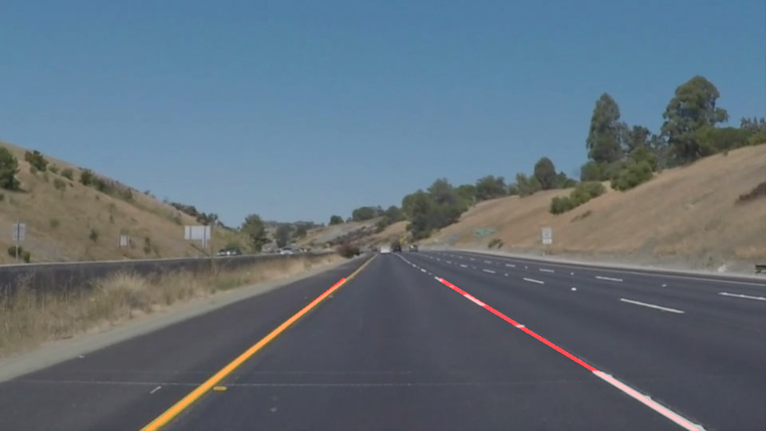

**First Project: Masking Lines on the Road Image** 

---

### Reflection

### 1. My pipeline consisted of 5 steps. First, I converted the images to grayscale. This gives a better contrast on the lane lines. Then, I smoothed the image using gaussian blur by running 5x5 filter through it. Third, I used canny edge detection to get the edge features that can be traced in the image. Because we only want to draw lines for the lanes, I specified drawing area to be on just the region of interest and lastly, draw the hough lines on that region of the image.

In order to draw a single line on the left and right lanes, I modified the draw_lines() function by fitting a line with the same tangent for each of the left and right lane line and extend it to the bottom max Y coordinate. I also had to check the starting coordinate of the line so as to make it inside the region of interest.

### 2. Identify potential shortcomings with your current pipeline

One potential shortcoming would be what would happen when the image is taken at dark night. The lines seen under the headlight light will have completely different contrast and are only limited in sight (vs. until the end of the road during daytime) 

Another shortcoming seen is the line drawn may not be as fast as it needs to be if the car is running a lot faster. Plus, if the curve is sharper, I don't have full confidence the current pipeline is enough to tackle it.

### 3. Suggest possible improvements to your pipeline

A possible improvement would be to capture the incoming slope based on a second or even third regions of interest as a help to smartly predict the next hough lines' algorithm parameters.
